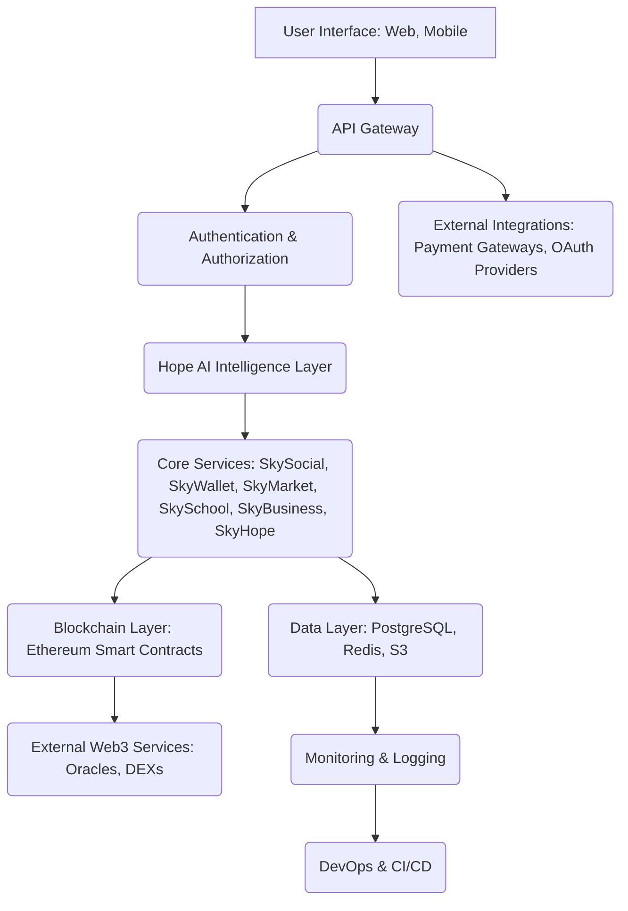
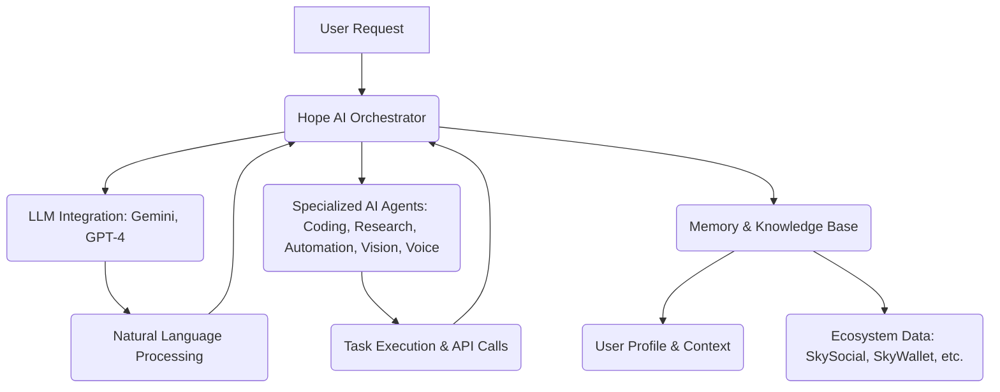

# SKYCOIN4444 Technical Architecture Whitepaper

**Author:** Manus AI
**Date:** July 11, 2026
**Version:** 1.0

## 1. Executive Summary

This Technical Architecture Whitepaper provides a comprehensive overview of the SKYCOIN4444 ecosystem's design, infrastructure, and underlying technologies. SKYCOIN4444 is an AI-powered Web3 operating system that unifies diverse functionalities including social networking, digital identity, education, finance, commerce, and intelligent assistants into a single, integrated platform. This document details the architectural decisions, technology stack, and scaling strategies employed to ensure a robust, secure, and highly performant system capable of supporting enterprise-grade applications and a global user base.

The architecture is designed for modularity, scalability, and resilience, leveraging modern cloud-native principles, advanced AI integration, and a robust blockchain foundation. It emphasizes a clear separation of concerns, enabling independent development, deployment, and scaling of various components while maintaining a cohesive user experience through the Hope AI intelligence layer.

## 2. Introduction to SKYCOIN4444

SKYCOIN4444 is an ambitious, integrated ecosystem designed to redefine the digital experience. It addresses the fragmentation prevalent in today's digital landscape by offering a unified platform where users can seamlessly interact with AI, Web3, social, educational, and business tools. The core philosophy is to empower users with a comprehensive suite of tools that are intelligent, secure, and interconnected.

### 2.1. Vision

To be the leading AI-powered Web3 operating system that empowers individuals and enterprises with a unified, intelligent, and secure digital life.

### 2.2. Mission

To build a scalable, interoperable, and user-centric ecosystem that integrates cutting-edge AI, blockchain technology, and intuitive design to solve real-world problems and foster a thriving digital community.

### 2.3. Core Principles

*   **Integration:** Seamlessly connect disparate digital functionalities.
*   **Intelligence:** Leverage AI to personalize and automate user experiences.
*   **Security:** Implement robust measures to protect user data and assets.
*   **Scalability:** Design for global adoption and high transaction volumes.
*   **Decentralization:** Empower users with ownership and control.
*   **Transparency:** Open and verifiable processes, especially for blockchain components.

## 3. High-Level Architecture Overview

SKYCOIN4444 employs a microservices-oriented architecture, orchestrated within a cloud-native environment. The system is logically divided into several layers, each responsible for specific functionalities, communicating via well-defined APIs. Hope AI acts as the central intelligence layer, interacting with all modules to provide a personalized and proactive user experience.

**Key Architectural Components:**

*   **User Interface (UI):** Frontend applications for web and mobile, built with modern frameworks.
*   **API Gateway:** Central entry point for all client requests, handling routing, load balancing, and security.
*   **Authentication & Authorization:** Manages user identities, access control, and session management.
*   **Hope AI Intelligence Layer:** The core AI engine that powers intelligent features across the ecosystem.
*   **Core Services (Microservices):** Independent services for each major module (e.g., SkySocial, SkyWallet).
*   **Data Layer:** Persistent storage, caching, and file storage solutions.
*   **Blockchain Layer:** Smart contracts and blockchain interactions for Web3 functionalities.
*   **External Integrations:** Connections to third-party services.
*   **Monitoring & Logging:** Centralized systems for observability and performance tracking.
*   **DevOps & CI/CD:** Automated processes for development, testing, and deployment.

## 4. Frontend Architecture

The frontend of SKYCOIN4444 is designed for responsiveness, performance, and a rich user experience. It adheres to modern web and mobile development best practices, ensuring accessibility and cross-platform compatibility.

### 4.1. Technology Stack

*   **Web Framework:** React 19
*   **Styling:** Tailwind CSS 4, Shadcn/UI
*   **State Management:** React Context API, tRPC client-side hooks
*   **Routing:** Wouter
*   **Build Tool:** Vite
*   **Testing:** Vitest

### 4.2. Component-Based Design

The UI is built using a modular, component-based approach, with over 1,700 TypeScript/TSX files representing individual React components. This promotes reusability, maintainability, and scalability of the frontend codebase. Key components are organized into logical directories:

*   `client/src/pages/`: Page-level components for routes.
*   `client/src/components/`: Reusable UI components, including Shadcn/UI integrations.
*   `client/src/contexts/`: React Contexts for global state management.
*   `client/src/hooks/`: Custom React hooks for shared logic.

### 4.3. Responsive Design

All frontend applications are developed with a mobile-first approach, ensuring optimal viewing and interaction across various devices and screen sizes. Tailwind CSS breakpoints and responsive utilities are extensively used to adapt layouts and styles dynamically.

### 4.4. Performance Optimization

*   **Code Splitting:** Lazy loading of components and routes to reduce initial bundle size.
*   **Image Optimization:** Use of modern image formats (WebP) and responsive images.
*   **Caching:** Browser caching for static assets.
*   **Server-Side Rendering (SSR):** Planned for SEO and initial load performance for public-facing pages.

## 5. Backend Architecture

The backend is built as a robust, scalable, and secure microservices platform, providing APIs for all frontend applications and external integrations.

### 5.1. Technology Stack

*   **Language:** TypeScript
*   **Framework:** Express 4
*   **RPC Layer:** tRPC 11
*   **Database ORM:** Drizzle ORM
*   **Testing:** Vitest
*   **Runtime:** Node.js

### 5.2. Microservices Design

Each core module of SKYCOIN4444 (e.g., SkySocial, SkyWallet, SkyMarket) is implemented as a distinct microservice or a logical grouping of tRPC procedures within the `server/routers.ts` structure. This allows for independent development, deployment, and scaling, enhancing agility and fault isolation.

### 5.3. API Design (tRPC)

SKYCOIN4444 utilizes tRPC for its API layer, providing end-to-end type safety from the backend to the frontend. This eliminates the need for manual schema generation and client-side SDKs, significantly improving developer experience and reducing integration errors.

*   **Procedures:** Defined in `server/routers.ts`, categorized by module.
*   **Authentication:** `protectedProcedure` ensures secure access, injecting `ctx.user` for authenticated requests.
*   **Data Transfer:** Superjson is used out-of-the-box, preserving complex data types like `Date` objects.
*   **Gateway:** All RPC traffic is routed under `/api/trpc`, facilitating easy edge routing and API management.

### 5.4. Authentication & Authorization

*   **Manus OAuth:** Integrated for secure user authentication, handling login flows and session management.
*   **Session Management:** Secure, HTTP-only session cookies are used to maintain user sessions.
*   **Role-Based Access Control (RBAC):** The `user` table includes a `role` field (`admin` | `user`) to enforce granular access control at the API level (`adminOnlyProcedure`).
*   **JWT (JSON Web Tokens):** Used for session cookie signing and secure API communication.

## 6. Data Layer

The data layer is designed for high availability, performance, and data integrity, utilizing a combination of relational databases, caching mechanisms, and object storage.

### 6.1. Database

*   **Primary Database:** PostgreSQL (managed service like AWS RDS for scalability and reliability).
*   **ORM:** Drizzle ORM for type-safe database interactions and schema management.
*   **Schema Management:** `drizzle/schema.ts` defines database tables and types. Migrations are generated via `pnpm drizzle-kit generate` and applied via `webdev_execute_sql`.

### 6.2. Caching

*   **Redis:** Used for in-memory data caching, session storage, and real-time data streams to reduce database load and improve response times.

### 6.3. File Storage (S3)

*   **AWS S3:** Primary storage for all user-generated content, static assets, and media files. This ensures scalability, durability, and cost-effectiveness.
*   **Storage Helpers:** `storagePut()` and `storageGet()` functions abstract S3 interactions, providing secure, presigned URLs for file access.
*   **Metadata:** File metadata (URL, fileKey, filename, mimeType) is stored in the PostgreSQL database for querying and authorization, while the actual file bytes reside in S3.

## 7. Blockchain Integration

SKYCOIN4444 leverages blockchain technology for core Web3 functionalities, including cryptocurrency, NFTs, decentralized governance, and transparent asset management.

### 7.1. Smart Contracts

*   **Platform:** Ethereum (EVM-compatible chains for future scalability).
*   **Language:** Solidity
*   **Standard:** ERC-20 for SKYCOIN token, ERC-721 for NFTs.
*   **Contracts Developed:**
    *   **SKYCOIN4444-smart-contract.sol:** ERC-20 token with 1 billion supply, founder/investor/team/charity allocations, vesting, burn, and pause functionalities.
    *   **SKYCOIN4444-Vesting.sol:** Manages token vesting schedules for founders, team, and advisors (e.g., 4-year vesting with 1-year cliff).
    *   **SKYCOIN4444-Marketplace.sol:** Facilitates buying, selling, and trading of digital and physical goods, including NFTs, with secure escrow and fee mechanisms.
    *   **SKYCOIN4444-Staking.sol:** Enables users to stake SKYCOIN tokens to earn rewards and participate in network security/governance.
    *   **SKYCOIN4444-DAO.sol:** Implements decentralized autonomous organization (DAO) for community governance, allowing token holders to propose and vote on key decisions.
    *   **SKYCOIN4444-NFT.sol:** ERC-721 compliant contract for unique digital assets, supporting GameFi, digital art, and other collectibles within the ecosystem.

### 7.2. Deployment & Verification

*   **Framework:** Hardhat for smart contract development, testing, and deployment.
*   **Deployment Script:** `SKYCOIN4444-deploy.js` automates deployment to Ethereum mainnet, token allocation, and Etherscan verification.
*   **Multi-Signature Wallets:** Gnosis Safe (2-of-3 or similar) for securing critical token allocations (e.g., founder, treasury) and managing contract upgrades.

### 7.3. Blockchain Interaction

*   **Web3.js/Ethers.js:** Libraries for interacting with Ethereum smart contracts from the backend.
*   **Oracles:** Chainlink or similar for bringing off-chain data (e.g., market prices) onto the blockchain for smart contract execution.
*   **Layer 2 Scaling:** Future integration with Layer 2 solutions (e.g., Polygon, Arbitrum, Optimism) to reduce transaction costs and increase throughput.

## 8. AI Integration (Hope AI)

Hope AI is the intelligent core of SKYCOIN4444, providing personalized experiences, automation, and advanced functionalities across all modules. It operates as a multi-modal, multi-agent AI system.

### 8.1. Hope AI Architecture

Hope AI is designed as a modular AI service layer, integrated with various Large Language Models (LLMs) and specialized AI agents.

**Components:**

*   **Hope AI Orchestrator:** Routes user requests to appropriate LLMs or specialized agents, manages context, and synthesizes responses.
*   **LLM Integration:** Utilizes state-of-the-art LLMs (e.g., Gemini, GPT-4) for natural language understanding, generation, and complex reasoning.
*   **Specialized AI Agents:**
    *   **Coding Agent:** Assists with code generation, debugging, and technical documentation.
    *   **Research Agent:** Gathers and synthesizes information from various sources.
    *   **Automation Agent:** Executes tasks across SKYCOIN4444 modules via API calls.
    *   **Vision Agent:** Processes images and video for content analysis and generation.
    *   **Voice Agent:** Enables voice navigation and interaction with the platform.
*   **Memory & Knowledge Base:** Stores user preferences, conversation history, and ecosystem-wide data to provide personalized and context-aware interactions.

### 8.2. AI Capabilities

*   **Intelligent Assistant:** Proactive suggestions, task automation, personalized recommendations.
*   **Code Generation & Review:** Assists developers with writing, optimizing, and debugging code.
*   **Content Creation:** Generates text, images, and potentially video/audio content.
*   **Data Analysis:** Processes and visualizes data from various SKYCOIN4444 modules.
*   **Educational Tutoring:** Provides personalized learning paths and assistance within SkySchool.
*   **Business Automation:** Automates workflows, reporting, and administrative tasks.

### 8.3. AI Transparency & Ethics

SKYCOIN4444 adheres to principles of responsible AI development:

*   **Clear Disclaimers:** Explicitly states that Hope AI does not guarantee correctness or provide professional advice (financial, legal, medical).
*   **User Control:** Users retain control over AI actions and data usage.
*   **Bias Mitigation:** Continuous efforts to identify and reduce algorithmic bias.
*   **Data Privacy:** AI processing adheres to strict data privacy policies.

## 9. Infrastructure & DevOps

The infrastructure is designed for high availability, scalability, security, and automated deployment, leveraging cloud-native services and modern DevOps practices.

### 9.1. Cloud Provider

*   **Primary Cloud:** AWS (Amazon Web Services)

### 9.2. Core Services

*   **Compute:** AWS EC2, AWS Lambda (for serverless functions), AWS Fargate (for container orchestration).
*   **Networking:** AWS VPC, AWS Load Balancers (ALB, NLB), AWS Route 53 (DNS).
*   **Database:** AWS RDS (PostgreSQL), AWS ElastiCache (Redis).
*   **Storage:** AWS S3 (object storage), AWS EBS (block storage).
*   **Security:** AWS IAM, AWS WAF, AWS Shield, AWS KMS.
*   **Monitoring & Logging:** AWS CloudWatch, AWS X-Ray, ELK Stack (Elasticsearch, Logstash, Kibana).

### 9.3. Containerization & Orchestration

*   **Containerization:** Docker for packaging applications and their dependencies.
*   **Orchestration:** AWS ECS (Elastic Container Service) with Fargate for managing and scaling containerized microservices.

### 9.4. CI/CD Pipeline

*   **Platform:** GitHub Actions
*   **Stages:**
    1.  **Code Commit:** Developers push code to GitHub.
    2.  **Build:** Automated build process (Vite for frontend, TypeScript compilation for backend).
    3.  **Test:** Unit, integration, and end-to-end tests (Vitest, Playwright).
    4.  **Security Scan:** Static Application Security Testing (SAST) and Dependency Vulnerability Scanning.
    5.  **Containerization:** Docker image creation and tagging.
    6.  **Deployment:** Automated deployment to staging and production environments (AWS CodeDeploy, ECS).
    7.  **Monitoring:** Post-deployment health checks and alerts.

### 9.5. Scaling Strategy

*   **Horizontal Scaling:** Microservices are designed to be stateless, allowing for easy horizontal scaling by adding more instances.
*   **Auto-Scaling:** AWS Auto Scaling Groups and ECS Service Auto Scaling automatically adjust compute capacity based on demand.
*   **Caching:** Extensive use of Redis to offload database reads.
*   **Load Balancing:** AWS Load Balancers distribute traffic efficiently across instances.
*   **Database Scaling:** AWS RDS read replicas and sharding strategies for PostgreSQL.

## 10. Security Architecture

Security is paramount in the SKYCOIN4444 ecosystem, especially given its Web3 and financial components. A multi-layered security approach is implemented across all architectural components.

### 10.1. Application Security

*   **Input Validation:** Strict validation of all user inputs to prevent injection attacks (SQL, XSS).
*   **API Security:** tRPC provides type safety, reducing common API vulnerabilities. Rate limiting and API keys for external access.
*   **Authentication:** OAuth 2.0, JWTs, MFA support.
*   **Authorization:** Role-Based Access Control (RBAC) enforced at the API and database layers.
*   **Session Management:** Secure, HTTP-only cookies, regular session rotation.
*   **Dependency Scanning:** Automated scanning of third-party libraries for known vulnerabilities.
*   **Code Review:** Peer code reviews and static analysis tools (ESLint, SonarQube) to identify security flaws.

### 10.2. Data Security

*   **Encryption in Transit:** All communication uses TLS 1.3 (HTTPS, WSS).
*   **Encryption at Rest:** Database (PostgreSQL) and file storage (S3) are encrypted using AES-256 with AWS KMS.
*   **Secrets Management:** Environment variables and sensitive credentials are stored and managed securely using AWS Secrets Manager.
*   **Data Minimization:** Only necessary data is collected and stored.
*   **Data Retention:** Policies for data retention and deletion are implemented.

### 10.3. Infrastructure Security

*   **Network Segmentation:** AWS VPCs and security groups isolate different components of the infrastructure.
*   **Firewalls:** AWS WAF and network ACLs protect against common web exploits and malicious traffic.
*   **DDoS Protection:** AWS Shield Advanced and CloudFlare for advanced DDoS mitigation.
*   **Vulnerability Scanning:** Regular scanning of infrastructure and applications for vulnerabilities.
*   **Least Privilege:** IAM roles and policies enforce the principle of least privilege for all services and users.
*   **Audit Logging:** Comprehensive logging of all system activities for security auditing and incident investigation.

### 10.4. Blockchain Security

*   **Smart Contract Audits:** Third-party security audits by reputable firms (e.g., OpenZeppelin, Certik) are conducted before mainnet deployment.
*   **Formal Verification:** Planned for critical smart contracts to mathematically prove correctness.
*   **Multi-Signature Wallets:** For treasury and critical asset management.
*   **Time Locks:** For contract upgrades and critical parameter changes.
*   **Monitoring:** Real-time monitoring of smart contract events and blockchain transactions for anomalies.

### 10.5. Disaster Recovery & Business Continuity

*   **Automated Backups:** Daily, encrypted backups of all databases and critical data to geographically separate regions.
*   **Point-in-Time Recovery:** For databases, enabling restoration to any specific moment.
*   **Multi-Region Deployment:** Planned for critical services to ensure high availability and disaster recovery.
*   **Incident Response Plan:** Documented procedures for identifying, responding to, and recovering from security incidents and system outages.
*   **Recovery Time Objective (RTO):** Target of 4 hours for critical services.
*   **Recovery Point Objective (RPO):** Target of 1 hour for critical data.

## 11. Scaling Strategy

SKYCOIN4444 is designed to scale from a beta launch to millions of users and enterprise clients, with a focus on both technical and operational scalability.

### 11.1. Technical Scaling

*   **Microservices:** Enables independent scaling of individual services based on demand.
*   **Serverless Components:** AWS Lambda for event-driven, auto-scaling compute.
*   **Container Orchestration:** AWS ECS with Fargate for efficient resource utilization and scaling of containerized applications.
*   **Database Sharding:** Planned for PostgreSQL to distribute data and load across multiple database instances as user base grows.
*   **Read Replicas:** AWS RDS read replicas to offload read traffic from the primary database.
*   **CDN:** AWS CloudFront for global content delivery and caching of static assets.
*   **API Gateway:** Handles traffic spikes, rate limiting, and request routing.

### 11.2. Operational Scaling

*   **Automation:** Extensive use of CI/CD, infrastructure as code (Terraform/CloudFormation), and automated testing to streamline operations.
*   **Monitoring & Alerting:** Proactive identification of performance bottlenecks and system issues.
*   **Documentation:** Comprehensive documentation of architecture, processes, and troubleshooting guides.
*   **Support System:** Scalable customer support infrastructure (FAQ, ticketing system, knowledge base).
*   **Team Growth:** Hiring roadmap to support increasing operational demands.

## 12. Conclusion

The technical architecture of SKYCOIN4444 is a robust, scalable, and secure foundation for an integrated AI-powered Web3 ecosystem. By leveraging a microservices approach, cloud-native services, advanced AI, and blockchain technology, SKYCOIN4444 is well-positioned to deliver a unique and powerful digital experience to its users. The emphasis on security, scalability, and operational excellence ensures that the platform can evolve and grow to meet the demands of a global audience and enterprise adoption. This architecture not only supports the current vision but also provides the flexibility to integrate future innovations in AI, Web3, and beyond.
